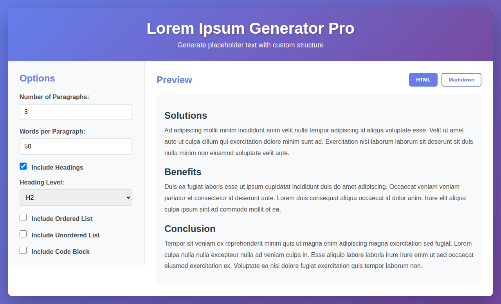
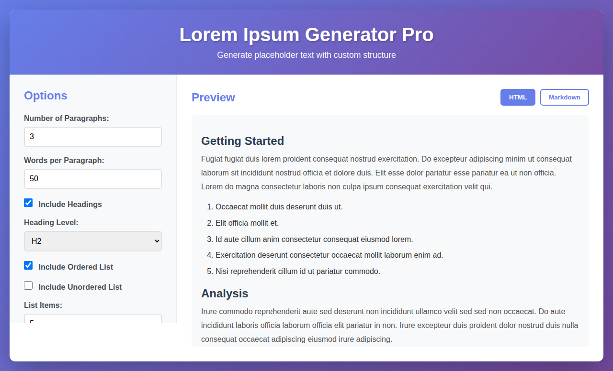
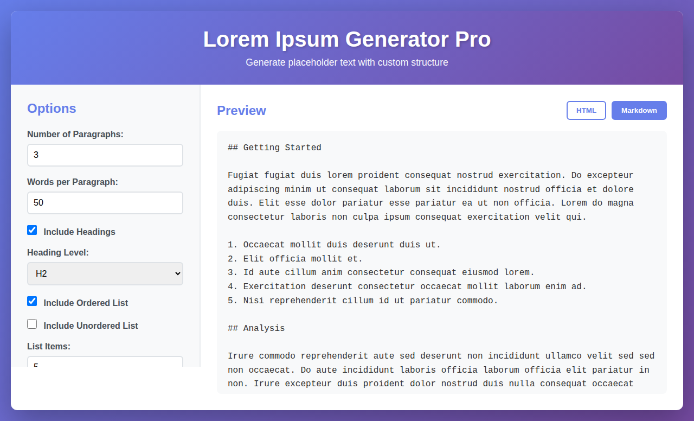

# Lorem Ipsum Generator Pro

Generate placeholder text with custom structure including paragraphs, headings, lists, code blocks, and word limits with real-time preview.

## Features

- **Multiple Paragraphs**: Generate 1-50 paragraphs of lorem ipsum text
- **Word Limit Control**: Set custom word count per paragraph (10-500 words)
- **Headings**: Add headings (H1-H6) to structure your content
- **Lists**: Include ordered or unordered lists with customizable item count
- **Code Blocks**: Add code block examples to your generated text
- **Real-time Preview**: View generated content instantly in HTML or Markdown format
- **Copy to Clipboard**: Easily copy generated content in your preferred format
- **Responsive Design**: Works seamlessly on desktop and mobile devices

## Usage

1. Open `index.html` in your web browser
2. Configure your options:
   - Set the number of paragraphs
   - Adjust words per paragraph
   - Toggle headings, lists, and code blocks
   - Customize heading levels and list item counts
3. Click "Generate" to create your lorem ipsum text
4. Switch between HTML and Markdown preview
5. Click "Copy to Clipboard" to copy the generated content

## Options

### Basic Options
- **Number of Paragraphs**: Control how many paragraphs to generate
- **Words per Paragraph**: Set the target word count for each paragraph

### Content Types
- **Include Headings**: Add section headings to your content
  - Choose heading level (H1-H6)
- **Include Ordered List**: Add numbered lists
- **Include Unordered List**: Add bullet point lists
  - Set number of list items (3-20)
- **Include Code Block**: Add formatted code examples
  - Set number of code lines (3-30)

### Preview Modes
- **HTML View**: See how the content renders as HTML
- **Markdown View**: View the content in Markdown format

## Technologies Used

- HTML5
- CSS3 (with modern features like Grid and Flexbox)
- Vanilla JavaScript (ES6+)

## Browser Support

Works in all modern browsers that support ES6:
- Chrome/Edge (latest)
- Firefox (latest)
- Safari (latest)

## License

MIT License - See LICENSE file for details
